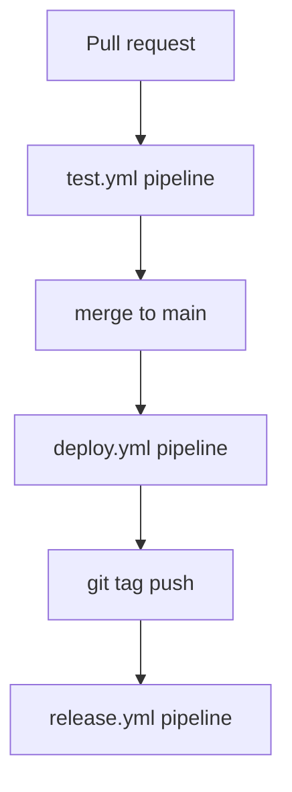

# Gardusig CI/CD — Docker pipeline

Every repository uses the **same local commands as GitHub Actions**. Workflows are a single sequential `pipeline` job that shells out to scripts; each script builds and runs a Dockerfile target.

## Commands

| Phase | Local | Dockerfile target |
|-------|-------|-------------------|
| Test | `./scripts/test/all.sh` | `unit` → `integration` |
| Deploy | `./scripts/deploy/deploy.sh` | `deploy` |
| Release | `./scripts/release/build.sh` | `release` |

CLI additionally: `version` and `pypi-test` in test pipeline; `pypi-publish` after release build.

## Layout (every repo)

```
Dockerfile                    # unit | integration | deploy | release (+ comments)
scripts/docker/
  _common.sh                  # build target + timeout + docker run
  run-unit.sh                 # test commands (inside unit image)
  run-integration.sh
  run-deploy.sh               # cli git deploy --yes
  run-release.sh              # write artifacts to /artifacts
scripts/test/
  unit.sh | integration.sh | all.sh
scripts/deploy/deploy.sh
scripts/release/build.sh
.github/workflows/
  test.yml                    # one job → ./scripts/test/all.sh
  deploy.yml                  # one job → ./scripts/deploy/deploy.sh
  release.yml                 # build.sh → gh release upload
```

## Timeouts

| Gate | Default |
|------|---------|
| Unit | 120s |
| Integration | 480s |
| Deploy | 600s |
| Release build | 900s |

Override with `REPO_UNIT_TIMEOUT_SEC`, etc.

## Workflow chain (no parallel jobs)



Inside `test.yml`, `./scripts/test/all.sh` runs **unit then integration** sequentially on the host (each in its own container).

## Per-repo images

| Repo | Unit base | Integration base |
|------|-----------|------------------|
| cli | python:3.12-slim | + docker CLI static binary |
| chrome-extensions | node:22-alpine | same |
| cursor-skills | alpine:3.21 | same |
| computer-science | debian:bookworm-slim | node:22-bookworm-slim |
| gardusig, private | alpine:3.21 | same (no-op) |
| yugioh | docker:27-cli | same (+ nested component builds) |

Deploy is always `python:3.12-slim` with `gardusig-cli` (except `cli` uses `pip install -e .`).
