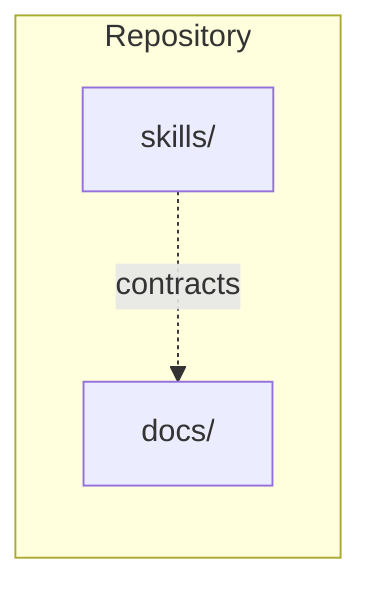
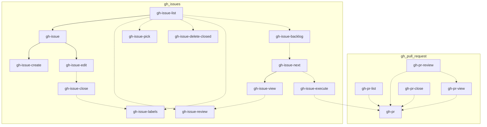

# Wiki hub — Cursor Agent Skills

Documentation for **this repository** is intentionally small and **topic-first**: this hub for **graphs**, **[`gh.md`](gh.md)** for public **`@gh-*`** skills, and **[`read.md`](read.md)** / **[`write.md`](write.md)** for **`read-*` / `write-*`** libraries. It does **not** mirror every folder under **`skills/`**.

This wiki is guidance for humans. Keep behavior and policy anchored to `skills/**/SKILL.md` and linked **`read-*` / `write-*`** libraries, and treat [`../.cursor/tests/README.md`](../.cursor/tests/README.md) checks as independent minimum validation only.

---

## Contents

1. [Location map](#location-map)
2. [Browse the wiki](#browse-the-wiki)
3. [Common commands](#common-commands)
4. [Layout vs `skills/`](#layout-vs-skills)
5. [Public skills (`@gh-*` only)](#public-skills)
6. [Read/write libraries (`read-*` / `write-*`)](#readwrite-libraries-read--write-)
7. [Contributing skills](#contributing-skills)
8. [See also](#see-also)

---

## Location map

| Location | What it is |
| --- | --- |
| **[`docs/README.md`](README.md)** (this file) | Hub: browse path, **public** invoke graph, common commands, contributing. |
| **[`gh.md`](gh.md)** | All **`@gh-*`** skills: catalog, links to **`skills/gh/**/SKILL.md`**, pointers to internal GitHub artifacts. |
| **[`onboarding.md`](onboarding.md)** | Install, public skill shape, standard GitHub flows. |
| **[`read.md`](read.md)** | Read-only **`read-*`** libraries (`skills/internal/read/**`). |
| **[`write.md`](write.md)** | Mutating **`write-*`** libraries (`skills/internal/write/**`), Q&A bypass ENV. |

**Install, `./.cursor/scripts/install.sh` flags, and environment variables:** root **[`README.md`](../README.md)** only.

There is **no HTTP API**, **no app server**, and **no database** — only Markdown and **`skills/**/SKILL.md`** contracts.

**Cursor install (any project):** run **`./.cursor/scripts/install.sh`** from this repo to copy skills into your **global** Cursor skills directory. **Public** **`@gh-*`** skills stay thin **orchestrators**; **normative rules** and command shapes live in **`read-*` / `write-*`** libraries.

---

## Browse the wiki

- **Start here** — [`docs/README.md`](README.md)
- **Pack onboarding** — [`onboarding.md`](onboarding.md)
- **Public skills** — **[`gh.md`](gh.md)** (`@gh-*`)
- **Internal libraries** — **[`read.md`](read.md)** (`read-*`), **[`write.md`](write.md)** (`write-*`)

---

## Common commands

1. **Discovery / file issues** — chat/planning → **`@gh-issue`**
2. **Backlog inspect** — **`@gh-issue-backlog`** · **`@gh-issue-next`**
3. **Execute checkpoints** — **`@gh-issue-execute`**
4. **Pull request** — **`@gh-pr`** (assumes branch is already on the remote)
5. **Review PR (AI)** — **`@gh-pr-review`**
6. **Merge PR** — GitHub UI (confirm with **`@gh-pr-view`**)

---

## Layout vs `skills/`

**`skills/`** holds authoritative **`SKILL.md`** files. Public orchestrators live under **`skills/gh/`**; internal libraries live under **`skills/internal/read/`** and **`skills/internal/write/`**.

---

## Public skills (`@gh-*` only)

Normative acyclic graph for user-invoked **`@gh-*`** skills in this pack.

**Orchestrator model:** each public skill is **policy + order + goals** and hands work to other **`@…`** skills and **`read-*` / `write-*`** libraries; deterministic GitHub I/O runs through **`shuttle gh`** ([`read-shuttle-gh`](../skills/internal/read/shuttle/gh/SKILL.md)).

- **Solid arrows** (`-->`) — required predecessor → successor.
- **Dotted arrows** (`-.->`) — optional or consult-only.

**Canonical spine:** `@gh-issue` → `@gh-issue-execute` → `@gh-pr` → `@gh-pr-view` → merge in GitHub UI.

When you add or rename a **public** skill or a **required** hand-off, update **this section**, **[`.cursor/tests/fixtures/public-skill-dag/graph.json`](../.cursor/tests/fixtures/public-skill-dag/graph.json)**, and **[`gh.md`](gh.md)** in the same change set. Run **`./.cursor/scripts/run.sh`**. Regenerate the mermaid body with **`python3 .cursor/tests/check-public-skill-dag.py --write-readme`** after editing the JSON.

**Authoring rule:** in each public **`SKILL.md`**, list only **direct** **`@…`** hand-offs.

### Full public DAG (acyclic)

<!-- public-skill-dag:mermaid:start -->

<!-- public-skill-dag:mermaid:end -->

### Reading the graph

| Edge | Meaning |
| --- | --- |
| **`ghIssueList` → `ghIssue`** | **`@gh-issue`** uses list inventory for dedupe. |
| **`ghIssuesExecute` -.-> `ghPr`** | **`@gh-issue-execute`** hands off to **`@gh-pr`** when checkpoints complete. |
| **`ghIssueBacklog` -.-> `ghIssueNext`** | **`@gh-issue-backlog`** may hand off to **`@gh-issue-next`** for the next child. |

Per-skill detail: **[`gh.md`](gh.md)**.

---

## Read/write libraries (`read-*` / `write-*`)

Libraries under **`skills/internal/read/<domain>/`** and **`skills/internal/write/<domain>/`**.

**Also read.** **`read-safety-structured-qa`** and **`read-safety-skill-safety`** govern confirms and prompt UX. **`read-shuttle-gh-*`** holds normative **`shuttle gh`** shapes for issues and PRs. Legacy **`write-issue-commands`** / **`write-pr-commands`** are deprecated fallbacks. Command ownership table: [`docs/read.md`](read.md).

---

## Contributing skills

1. Keep each public **`SKILL.md`** as orchestration only — link to **`read-*` / `write-*`** for shapes and runnable **`gh`** blocks.
2. Bulk or destructive steps — **`read-safety-skill-safety`** and **`read-safety-structured-qa`**.
3. After adding or renaming **`skills/**/SKILL.md`**, update **[`gh.md`](gh.md)** catalog tables, **[`read.md`](read.md)** / **[`write.md`](write.md)** when internal libraries change, **this file** if public **edges** change, and **[`.cursor/tests/fixtures/public-skill-dag/graph.json`](../.cursor/tests/fixtures/public-skill-dag/graph.json)**.

---

## See also

- **[`read-repo-layout`](../skills/internal/read/repo/layout/SKILL.md)** — how **`skills/`** and **`docs/`** relate (read-only contract).
