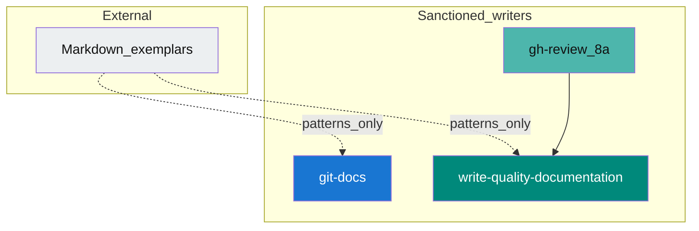

# Internal: Public documentation exemplars (`read-docs-exemplars`)

**Read-only library.** **Pointers and rules only** — use when **`write-quality-documentation`** or **`@git-docs`** should borrow **structure** (headings, tables, troubleshooting blocks) from well-known **markdown-in-repo** documentation. **Do not** paste large chunks of external text without license checks; **do not** bypass **`write-quality-documentation`** / **`@git-docs`** for substantive doc edits.

## Language interaction policy

Always apply [`read-safety-language-interaction-rules`](../../safety/language-interaction-rules/SKILL.md) first. Use English by default for all assistant output, including AskQuestion prompts/options, unless the user explicitly requests another full-language response.

## Skill ownership (sanctioned doc changes)

External repos inform **patterns** only; changes still flow through **`@git-docs`** or **`@git-review`** §8a → **`write-quality-documentation`**.

---

## Curated shortlist (markdown in tree)

Primary artifact should be **`.md` in the repository** (not a static site generator as the only source of truth).

| Source | Why it is useful | Extract | Skip |
| --- | --- | --- | --- |
| [github/opensource.guide](https://github.com/github/opensource.guide) | Short chapters; strong **contributing / community / legal** tone | Heading depth, “when to use this page”, cross-links, checklist-style sections | Product-specific GitHub UI copy |
| [thegooddocsproject](https://github.com/thegooddocsproject) (repos under the org) | Explicit **doc-type** templates (how-to, tutorial, reference stubs) | Skeleton ideas: prerequisites, steps, “see also”, troubleshooting | Toolchain-specific assumptions; verbatim merges without license review |
| Large OSS **`docs/`** trees in markdown (e.g. **eslint**, **nodejs** `doc/`, **pandas** narrative docs) | Real **guide vs reference** separation | How they split narrative from catalogs; tables and version notes | Install matrices and commands that are not this repo’s truth |
| **Small libraries** with clear READMEs (e.g. **semver**-style) | Above-the-fold clarity | First-screen structure; minimal badge/link discipline | Marketing READMEs that do not fit a skill-pack repo |

**Out of scope for this skill (do not treat as copy sources here):** Diátaxis site prose; Docusaurus / VitePress / MkDocs **site source** as template (SSG coupling). You may still map ideas mentally (tutorial vs how-to vs reference) without copying those sites.

---

## Filtering rubric (before adopting a pattern)

Apply when changing **`docs/README.md`**, **`docs/<domain>/.../README.md`**, **minimal root** **[`README.md`](../../../../README.md)**, or (legacy) monolithic **`docs/*`** files:

1. **Portability** — Works as **static markdown** with relative links and optional mermaid (**[`write-quality-documentation`](../../internal/write/quality/documentation/SKILL.md)** prefers mermaid).
2. **Hub fit** — Maps to **one** surface: **Quick guide / install** (root README), **skill catalog** (**`docs/git.md`** / **`docs/gh.md`** / **`docs/read.md`** / **`docs/write.md`** or a slimmer layout on other repos), **diagram** (mermaid in **`docs/README.md`** or domain wiki), or **single-file overview**—not scattered duplicates.
3. **License** — Prefer **CC / MIT / permissive** examples; avoid long **copyleft** or **all rights reserved** pastes without explicit check.
4. **No false precision** — Reject commands and claims that conflict with **this** repo’s **[`write-quality-evaluate`](../../internal/write/quality/evaluate/SKILL.md)** / CI (**[`read-config-configuration`](../configuration/SKILL.md)**).
5. **Size** — Respect **`@git-docs`** limits (~**400 lines** or ~**48 KiB** per narrative file; split when over).
6. **Single writer path** — Land improvements via **`write-quality-documentation`** or **`@git-docs`**, not ad-hoc agent edits outside those skills.

---

## Do

- Use this file to **choose** external patterns and **justify** section/table shapes when editing under **`write-quality-documentation`** or **`@git-docs`**.

## Do not

- **Copy** third-party documentation bodies into the repo from this skill alone — **adapt** minimally and attribute or link when required.
- Run shell, **`git`**, or **`gh`** — read-only reference.

---

## See also

- [`write-quality-documentation`](../../internal/write/quality/documentation/SKILL.md) — polish **existing** markdown
- [`@git-docs`](../../../git/docs/SKILL.md) — seeds, layout, splits
- [`read-docs-user-guide`](../doc-user-guide/SKILL.md) · [`read-docs-reference`](../doc-reference/SKILL.md) · [`read-docs-graphs`](../doc-graphs/SKILL.md) — greenfield **`wiki-reference-scaffold`** / diagram child skills
- [`read-repo-layout`](../repo-layout/SKILL.md) — doc hub placement
