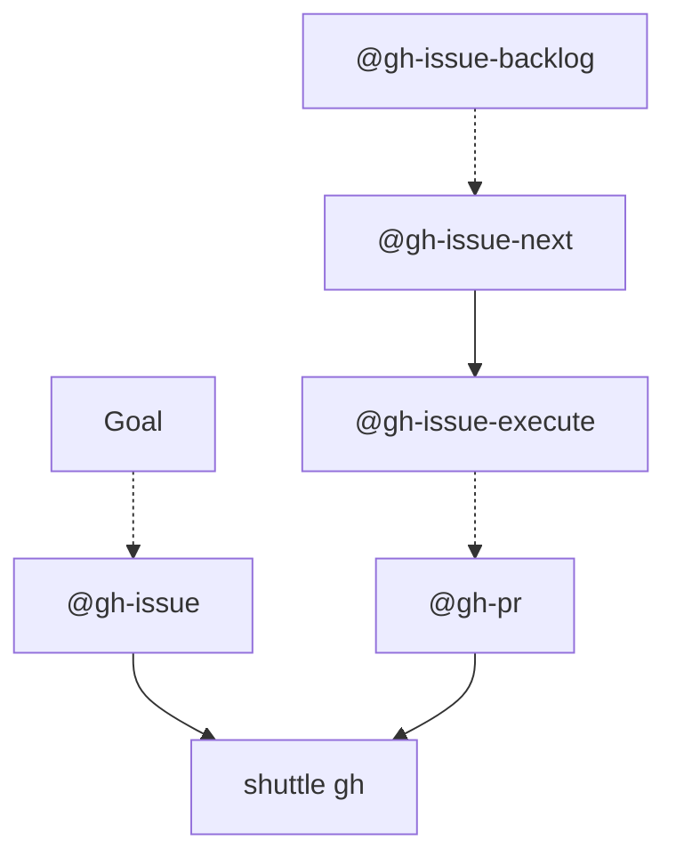

# Legacy graphs scaffold (compact)

Use this only for repositories that still keep a legacy graphs page. Keep the content short and rely on in-pack skill links.

## Language interaction policy

Always apply [`read-safety-language-interaction-rules`](../../../safety/language-interaction-rules/SKILL.md) first. Use English by default for all assistant output, including AskQuestion prompts/options, unless the user explicitly requests another full-language response.

## Rules

- Keep diagrams acyclic and focused on core public skills.
- Do not copy full command lists into this file.
- Source operational behavior from `skills/**/SKILL.md`.

## Minimal graph

## See also

- [`read-docs-graphs`](../SKILL.md)
- [`read-repo-layout`](../../repo-layout/SKILL.md)
- [`read-workflow-workflows`](../../workflows/SKILL.md)
