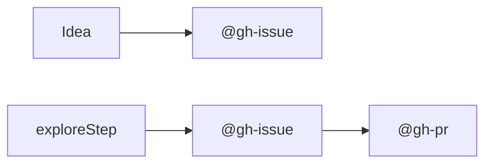
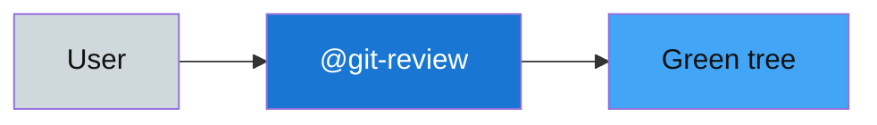

# TEMPLATE: repository root `README.md`

**Prefix** blocks below come **first**; then use **`read-docs-readme-root`** + **`read-docs-index`** for **Overview**, **See also**, **Contents** (**lists only**, no tables in Contents).

## Language interaction policy

Always apply [`read-safety-language-interaction-rules`](../../../safety/language-interaction-rules/SKILL.md) first. Use English by default for all assistant output, including AskQuestion prompts/options, unless the user explicitly requests another full-language response.

## 🧩 Brief pack variant (cursor-skills style)

Use this when the repository keeps rich narrative in **`docs/`** and wants a short root landing page.

Suggested structure:

1. `# <Repo title>` + one-line value proposition.
2. `## 🚀 Quick guide` with 2-4 first-run bullets.
3. `## 📦 Install` with the minimal command block:

```bash
./.cursor/scripts/install.sh
```

4. `## 🧭 Lane overview` with one small comparison table.
5. Optional `## 🗺️ Example flow` (single Mermaid block) using GitHub-safe quoted labels:



6. `## 📚 Learn more` with links to `docs/README.md`, `docs/git.md`, and `docs/gh.md`.

Guidelines for this brief variant:

- Keep **emoji** on major `##` titles.
- Use **tables** only for compact comparisons; keep **`## Contents`** as numbered lists when present.
- Keep Mermaid sparse (0-2 diagrams in root), and quote labels with special characters for GitHub compatibility.

---

# &lt;Repo title&gt;

&lt;What this repository is for today.&gt;

---

## 🚀 Quick guide

&lt;User-guide–style: first 2–3 things to do, where `skills/` or main code lives, how to invoke `@` skills.&gt;

---

## 🎯 Example usage



&lt;Replace nodes with **this repo’s** real skill names and paths.&gt;

---

## 🔭 Overview

&lt;High-level architecture; colored mermaid if helpful.&gt;

---

## 💰 Estimates / economics (optional)

*&lt;Explicitly labeled estimates&gt;* — e.g. marginal **cost per API call**, payload roll-ups aggregated from subtree READMEs. **Leaf-first** authoring: children hold granular tables; root **summarizes**.

---

## 📦 Install

&lt;Minimal commands.&gt; **Prefer** prompting the user to run **Terminal batches by hand**; do not assume the agent runs installs.

---

## 🔗 See also

1. [docs/README.md](docs/README.md) — documentation hub; domain indexes: [docs/git.md](docs/git.md), [docs/gh.md](docs/gh.md), [docs/read.md](docs/read.md), [docs/write.md](docs/write.md) (**this** pack)
2. …

---

## 📋 Contents

1. … &lt;numbered nested lists, lexicographic; **no markdown table**&gt;

---

## 🏥 Health (optional)

- **CI:** …

---

## Related

&lt;Legacy cross-links if not covered above.&gt;
