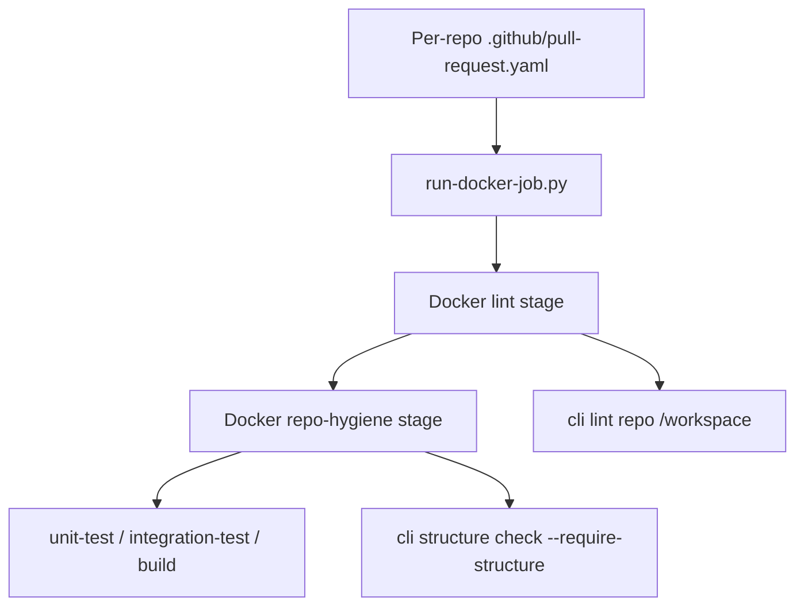

# Repository Contract

This is the canonical repository contract for the gardusig repositories.

## Active Decisions

- `gardusig/cli` owns validation logic, developer commands, root `Dockerfile`, and `scripts/ci/`.
- `gardusig/yaml` owns reusable GitHub Actions routers.
- App repositories keep application code plus [`.github/workflows/`](../.github/workflows/README.md):
  - `pull-request.workflow.yaml` / `release.workflow.yaml` — thin callers
  - `pull-request.yaml` / `release.yaml` — per-repo Docker job graphs
- CI shell stays in `scripts/ci/`; the installable package stays in `src/`.

## Docker Stage Model

Every repo `Dockerfile` follows the same stage order:

1. `lint` — `cli lint repo /workspace` inside Docker; it runs lint for each language present in that repo
2. `repo-hygiene` — layout, folder depth (up to policy `max_depth`), language allowlists, and forbidden orchestration artifacts
3. Repo-specific stages — `unit-test`, `integration-test`, `build`, `validate`, etc.

Example (`gardusig/cli`):

```bash
docker build --target lint -f Dockerfile .
docker build --target repo-hygiene -f Dockerfile .
docker build --target unit-test -f Dockerfile .
```

## App-repo workflow surface

`cli structure check` in Docker `repo-hygiene` targets allows exactly one app-repo workflow file:

- `README.md`
- `src/`
- `docs/`
- `test/` or `tests/`
- `.github/workflows/pull-request.workflow.yaml` as the PR caller
- `.github/workflows/pull-request.yaml` as the per-repo pipeline job graph

Each repo also owns pipeline config YAML under `.github/workflows/` (for example `pull-request.yaml`).

Hub orchestration (extra workflows, shared hub images) stays in `gardusig/yaml`.

`repo-hygiene` jobs declare `hygiene_policy` in `.github/workflows/pull-request.yaml`.

## Layout by repo type

- `python-cli`: `src/`, `docs/`, `tests/`, `config/`, `Dockerfile`, `.github/workflows/pull-request.yaml`
- Language libraries: `src/`, `docs/`, `tests/`, `Dockerfile`
- `github-pipelines`: `.github/`, `docker/` (hub images only), `docs/`, `Dockerfile`

## Resolve flow


