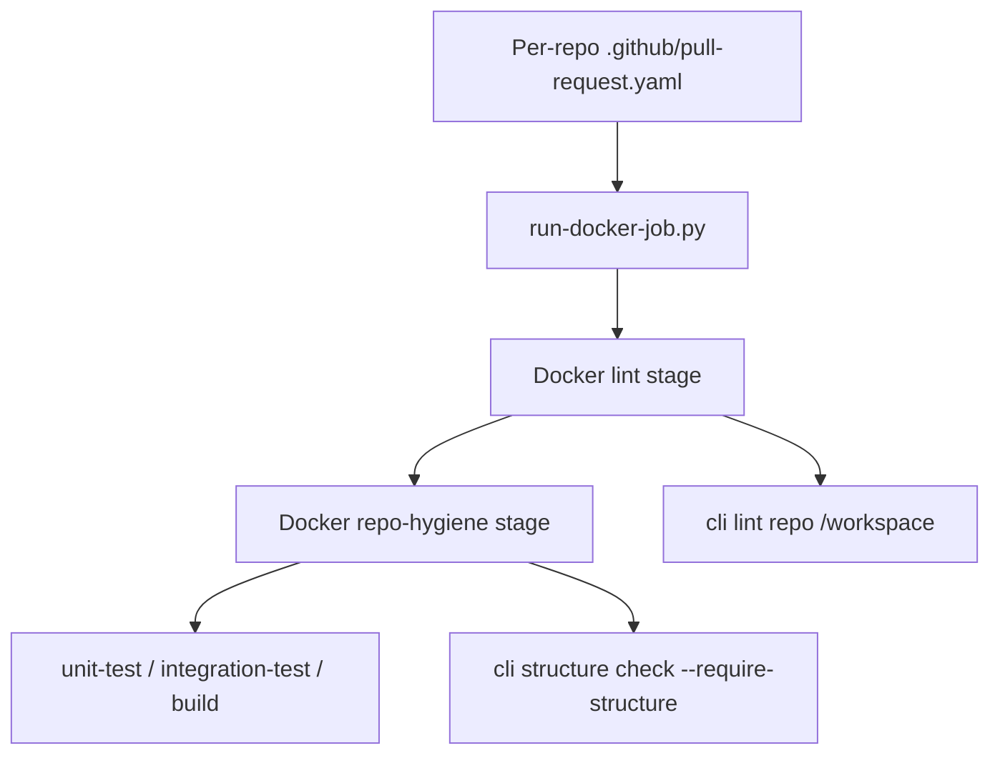

# Repository Contract

This is the canonical repository contract for the gardusig repositories.

## Active Decisions

- `python-cli` owns validation logic and developer commands.
- `github-pipelines` owns reusable GitHub Actions routers and Dockerfiles.
- App repositories keep application code plus:
  - `.github/workflows/pull-request.yml` — thin caller into the central router
  - `.github/workflows/release.yml` — optional tag publish workflow (language libraries)
  - `.github/pull-request.yaml` — per-repo job graph and hygiene policy
- App repositories must not contain Dockerfiles, CI scripts, or extra workflow
  files. Docker stages stay in `github-pipelines`.
- Each repository has exactly one multi-stage Dockerfile in
  `github-pipelines/docker/`.
- Setup and validation are Docker-first. Run individual stages instead of
  installing dependencies locally.

## Docker Stage Model

Every repo `Dockerfile` follows the same stage order:

1. `lint` — `cli lint repo /workspace` inside Docker; it runs lint for each language present in that repo
2. `repo-hygiene` — layout, folder depth (up to policy `max_depth`), language allowlists, and forbidden orchestration artifacts
3. Repo-specific stages — `unit-test`, `integration-test`, `build`, `validate`, etc.

Example (`gardusig/cli`):

```bash
docker build --target lint -f Dockerfile .
docker build --target repo-hygiene -f Dockerfile .
docker build --target unit-test -f Dockerfile .
```

## App-repo workflow surface

`cli structure check` in Docker `repo-hygiene` targets allows exactly one app-repo workflow file:

- `README.md`
- `src/`
- `docs/`
- `test/` or `tests/`
- `.github/workflows/pull-request.yml` as the only local workflow
- `.github/pull-request.yaml` as the per-repo pipeline job graph

Each repo also owns one pipeline config file:

- `.github/pull-request.yaml`

Hub orchestration (extra workflows, shared `cli-base` / `operator` images) stays in `github-pipelines`.

`repo-hygiene` jobs declare `hygiene_policy` in `.github/pull-request.yaml`. The reusable workflow forwards that policy to Docker as `HYGIENE_POLICY_JSON`, and the Docker target runs `cli structure check --policy-file` to enforce allowed languages and metadata files.

## Layout by repo type

- `python-cli`: `src/`, `docs/`, `tests/`, `config/`, `Dockerfile`, `.github/pull-request.yaml`
- Language libraries: `src/`, `docs/`, `tests/`, `Dockerfile`
- `github-pipelines`: `.github/`, `docker/` (hub images only), `docs/`, `Dockerfile`

## Resolve flow


