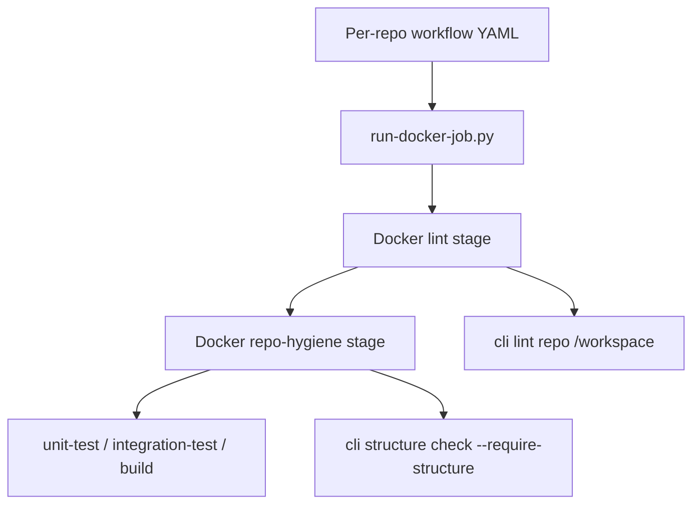

# Repository Contract

This is the canonical repository contract for the gardusig repositories.

## Active Decisions

- `python-cli` owns validation logic and developer commands.
- `github-pipelines` owns GitHub Actions workflows, Dockerfiles, and CI job graphs.
- App repositories keep application code plus one thin
  `.github/workflows/pull-request.yml` caller workflow.
- App repositories must not contain Dockerfiles, CI scripts, or extra workflow
  files. All orchestration stays in `github-pipelines`.
- Each repository has exactly one multi-stage Dockerfile in
  `github-pipelines/docker/`.
- Setup and validation are Docker-first. Run individual stages instead of
  installing dependencies locally.

## Docker Stage Model

Every repo Dockerfile follows the same stage order:

1. `lint` — `cli lint repo /workspace` inside Docker; it runs lint for each
   language present in that repo
2. `repo-hygiene` — layout, folder depth (up to policy `max_depth`), language
   allowlists, and forbidden orchestration artifacts
3. Repo-specific stages — `unit-test`, `integration-test`, `build`, `validate`,
   etc.

Examples:

```bash
# Lint only
docker build --target lint \
  -f ../github-pipelines/docker/python-cli.dockerfile .

# Structure check only
docker build --target repo-hygiene \
  -f ../github-pipelines/docker/python-cli.dockerfile .

# Unit tests only
docker build --target unit-test \
  -f ../github-pipelines/docker/python-cli.dockerfile .
```

## Root Layouts

Standard app repositories require:

- `README.md`
- `src/`
- `docs/`
- `test/` or `tests/`
- `.github/workflows/pull-request.yml` as the only local workflow

Structure policy can also cap directory depth (for example `max_depth: 3` for
profile repos, `max_depth: 5` for game repos).

Special repositories:

- `python-cli`: product CLI code with only `config/`, `docs/`, `src/`, and
  `tests/` at the repository root; command behavior lives in Python services and
  shell scripts are not allowed.
- `github-pipelines`: `.github/`, `docker/`, `docs/`.
- `computer-science`: toolchain-specific study areas and multi-pipeline CI.
- `database`: private vault, task files, documents, and validation metadata.
  Markdown documentation and task-body copies live in `wiki/database/`; database
  stores structured YAML/JSON metadata and document assets.
- `wiki`: markdown-oriented generated wiki and runbooks.

## Language Policy

CI enforces allowed file extensions and exact extensionless filenames through
`hygiene_policy` in each pull-request workflow config. Policies also declare
`allowed_root_dirs`, `allowed_root_files`, optional `allowed_paths`, ignored
prefixes, `max_depth`, and hard-deny fields such as `forbidden_extensions`,
`forbidden_paths`, and `forbidden_globs`.

Every PR workflow hard-denies `.sh`. Application/data repositories may also set
`forbid_direct_cli_references: true` so local docs/code do not mention the CLI
directly; workflow callers remain the only repo-local place that references
centralized pipeline behavior.

## Enforcement Path



`cli structure check` is the public structure gate. The legacy
`cli hygiene check` command remains as a hidden compatibility alias. The
pipelines repo passes each repository policy into `cli structure check` via
`HYGIENE_POLICY_JSON`.
