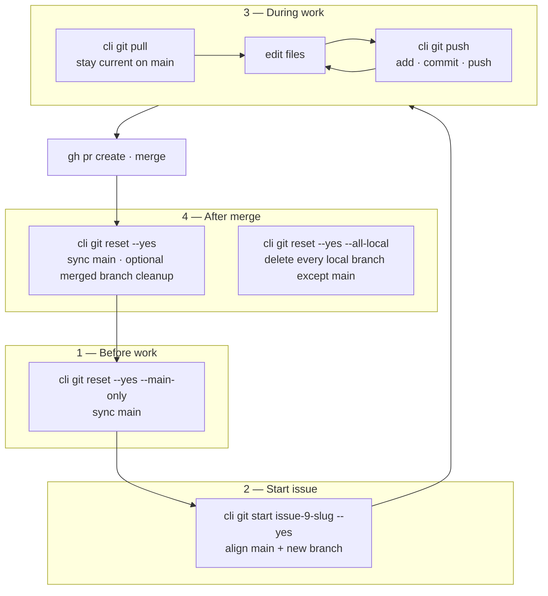
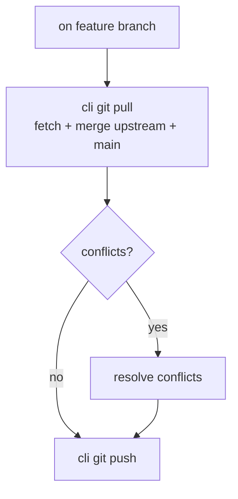
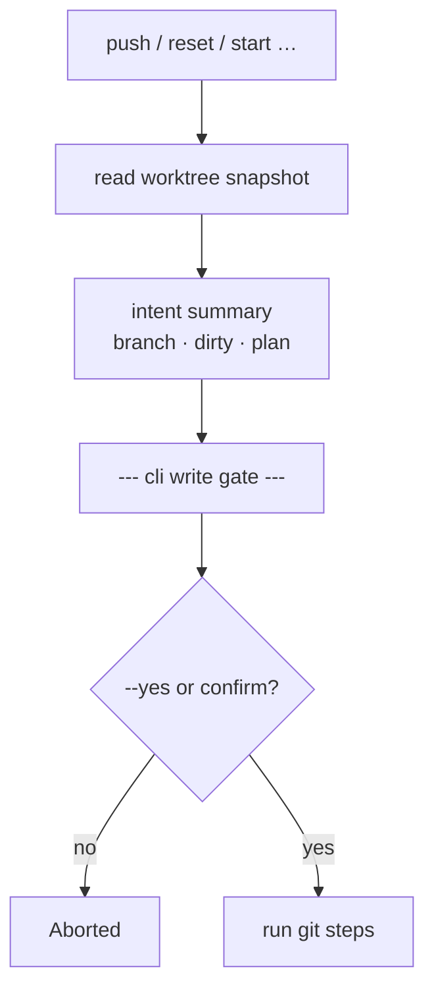
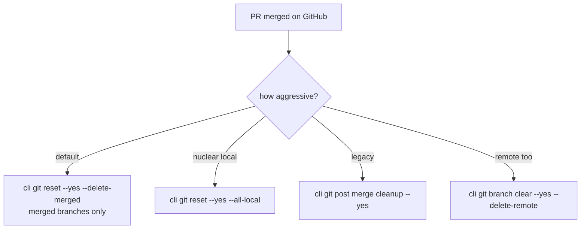
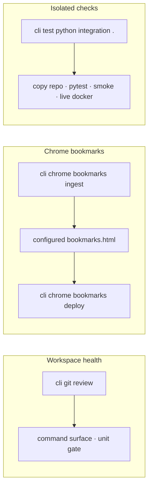
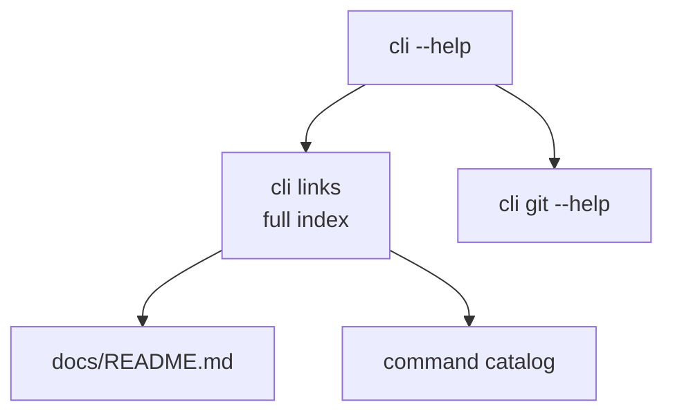

# Common usage flows

Visual maps for everyday `cli` workflows. Command details live in [git.md](git.md) and [quick-defaults.md](quick-defaults.md).

## Merged CLI workflow catalog

The central workflow catalog lives in `gardusig/gardusig/yaml/docs/workflows/cli.md`. `gardusig/yaml` hosts pipeline-backed workflows, but it is not a target app repo for CLI workflows.

| Workflow | Type | Systems |
| --- | --- | --- |
| `private-task-board-reset` | Pipeline-backed | `private` tasks -> GitHub Issues -> GitHub Project/order |
| `private-task-board-from-notion` | Pipeline-backed | Notion -> task-data PR -> GitHub board deploy |
| `python-cli-release-lane` | Pipeline-backed | version checks -> package build -> PyPI release |
| `python-cli-command-contract` | Pipeline-backed | command surface -> docs links -> dispatch smoke |
| `chat-to-issues` | Pipeline-triggered | chat summary -> AI categorize -> GitHub issues/backlog |
| `issue-ship-manual` | Hybrid | GitHub issue -> git branch -> PR -> UI merge |
| `ai-issue-ship` | Hybrid | AI issue execution -> PR -> AI review -> UI merge |
| `issue-refinement` | Pipeline-backed | epic issue -> subissue checklist -> subissue implementation plans |
| `issue-to-pr` | Pipeline-backed | next ready subissue -> PR plan -> branch/PR handoff |
| `plan-to-issues` | Hybrid | plan YAML -> GitHub labels/issues/backlog |
| `repo-health-verify` | Hybrid | git review -> tests -> Docker/command checks |
| `tag-backup-cloud` | Local-only | git tag -> zip -> cloud upload |
| `multi-repo-drive-sync` | Local-only | configured repos -> tag zips -> cloud/USB replicas |
| `chrome-bookmarks-roundtrip` | Local-only | Chrome -> local bookmarks file -> Chrome |
| `docker-reset-verify` | Local-only | Docker cleanup -> integration checks |

Pipeline-backed workflows must have explicit reviewed names and target repos. Local-only workflows can affect any repository listed in local CLI configuration.

## Full issue lifecycle



| Phase | Shortcut | What it does | Older equivalent |
| --- | --- | --- | --- |
| Sync main | `git reset --yes --main-only` | checkout `main`, fetch, pull/ff or hard-reset, clean worktree | `git main --yes` |
| Start issue | `git start [branch] --yes` | align main + `checkout -b` | — |
| Publish WIP | `git push --yes` | add + commit + push current branch; on `main`, start random branch first | `git commit` + `git push` |
| Stay current | `git pull` | fetch + merge upstream/main into feature branch | — |
| After merge | `git reset --yes --delete-merged` | return to synced main + delete **merged** branches | `git post merge cleanup --yes` |
| Nuclear local | `git reset --yes --all-local` | synced main + delete **all** local branches except main | `git branch clear --yes` |

All destructive steps show the **write gate** (branch, dirty state, intent) before running. Pass `--yes` / `-y` to skip the prompt (summary still prints).

**Leaving a feature branch:** `reset` commits uncommitted work on the current branch (message `.` by default) before syncing `main`. Pass `--discard` to drop uncommitted changes instead.

### Example session

```bash
# Monday: synced main
cli git reset --yes --main-only

# Pick up GitHub issue #9
cli git start issue-9-docker --yes

# Loop until PR is ready
cli git push          # interactive
cli git pull          # optional: merge latest main
cli git push --yes

# After PR merged
cli git reset --yes
# answer the follow-up prompt to run `branch delete --merged`, or:
cli git reset --yes --delete-merged
```

## GitHub phase (after PR is open)

Use CLI commands directly. See [gh.md](gh.md).

| Step | CLI |
| --- | --- |
| Pick next issue | `cli gh backlog next` |
| View issue | `cli gh issue view N` |
| Open PR | `cli gh pr --yes` |
| Check PR | `cli gh pr view N` |
| **Merge PR** | **GitHub UI / auto-merge** |
| Close issue | GitHub auto-close from merged PR body |

**Full chain:** `backlog next -> reset -> start -> review -> gh pr -> [UI merge + auto-close] -> reset`

## Issue Resolution

Epic issue work is refined before it is executed. Run `cli craft epic --number N --dry-run` to review an epic issue and its subissues, or `cli craft epic --number N --yes` to refresh the epic issue `## Subissues / Closure checklist` and comment implementation plans on each subissue.

Subissue work is the PR unit. Run `cli craft pr-plan --number N` to render the branch name, implementation guidance, and PR body without mutating anything. Run `cli craft pr --number N --repo-root . --yes` only after an implementation step has produced a real diff; epic issues are rejected.

Pipeline-backed equivalents live in `gardusig/yaml`:

| Workflow | Dispatch type | CLI command |
| --- | --- | --- |
| Issue refinement | `issue-refinement` | `cli craft --repo OWNER/REPO epic --number N` (`--dry-run` or `--yes`) |
| Issue to PR | `issue-to-pr` | `cli craft --repo OWNER/REPO issue-to-pr --number N` (`--dry-run true` or `false`) |

Epic issues are not closed directly by CLI. Every epic issue should keep a generated subissue checklist, and PR bodies should close subissues with `Fixes #subissue` rather than closing the epic issue.

### Example (GitHub steps)

```bash
cli gh backlog next --format json
# … git work on branch …
cli git review
cli gh pr --yes
# merge in GitHub UI with "Fixes #42" in the PR body, or enable auto-merge
cli git reset --yes --delete-merged
```

Ad hoc `cli gh project ...` and Rulesets remain blocked. Supported board writes go through
`cli project ...` (pairs deploy/ingest/sync) or named task-board workflows in
`gardusig/yaml`; otherwise use `cli gh backlog organize` and `priority:N` labels.
See [project.md](project.md).

## Feature work (start → publish)


## Sync with main (on feature branch)



## Write gate (destructive / remote)



## After merge (cleanup options)



## Health check & bookmarks



## Integration workflow tests

Four Docker E2E workflows (fixture config only — never host `~/git-local` or live `config/config.yaml`):

| Workflow | Steps |
| --- | --- |
| Plan → issues | `gh issue batch` → `backlog tree` → `backlog next` |
| Issue context | `gh issue context N` — epic, siblings, comments, linked issues |
| Dirty branch → PR | `git push --yes` → `gh pr create --yes` |
| Reset to main | nested dirty branches → `git reset --yes --delete-merged` |

Run on host (mocked `gh`): `cli test python command-surface .`  
Docker gate: `tests/integration/check_workflows.py` (wired in `cli test python command-surface .`)

Config isolation: default `CLI_CONFIG_DIR=config/ci`; per-workflow overrides under `tests/fixtures/workflows/<name>/config.yaml`.

## Discover commands



See also: [Architecture](architecture.md) · [Docker integration](docker.md) · `cli links`

## Merge policy {#merge-policy}

**Never merge from `cli`.** Use the GitHub UI or enable **auto-merge** on the PR after green checks.

- `cli gh pr merge` exits non-zero with a policy message
- Raw `gh pr merge` is blocked in `GhProvider` unless `CLI_ALLOW_GH_MERGE=1` (break-glass only)

Workflow chain ends at `[UI merge]` — not `cli gh pr merge`.
