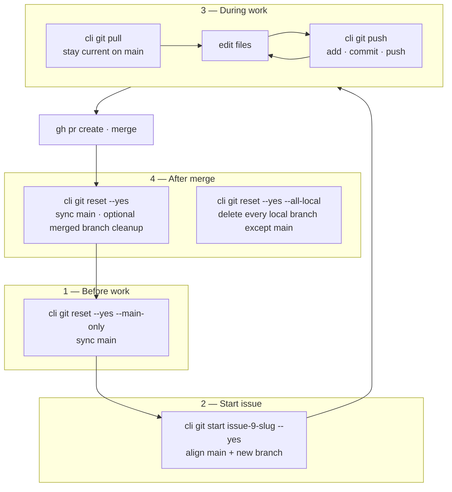
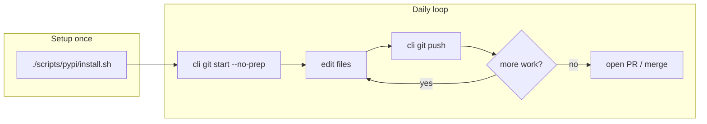
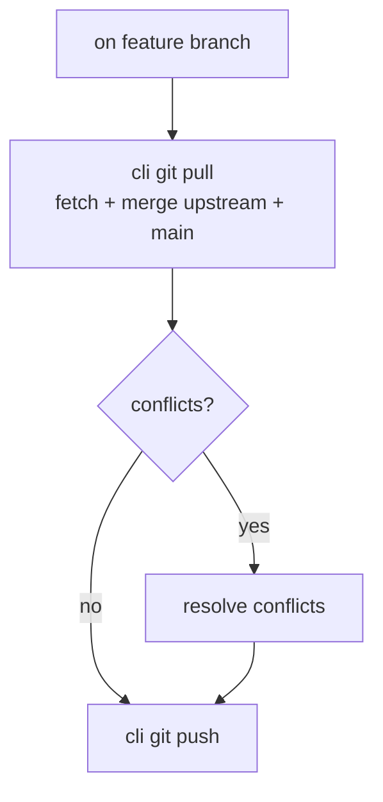
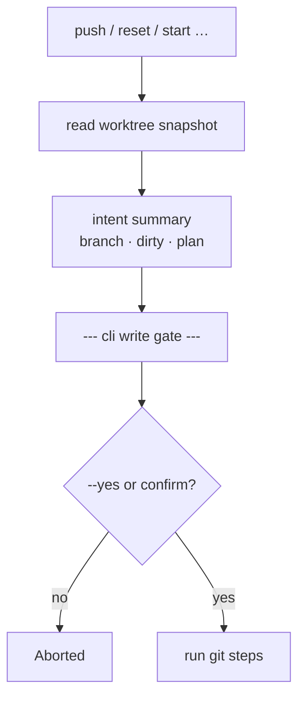
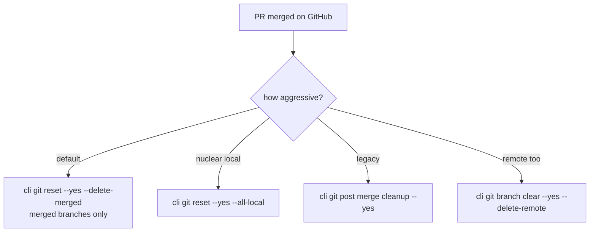
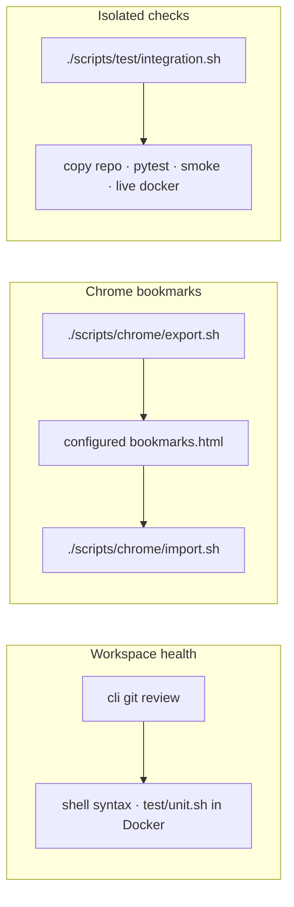
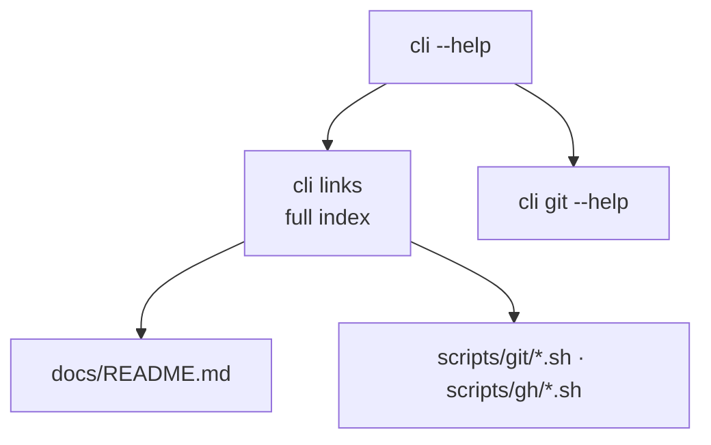

# Common usage flows

Visual maps for everyday `cli` workflows. Command details live in [git.md](git.md) and [quick-defaults.md](quick-defaults.md).

## Full issue lifecycle



| Phase | Shortcut | What it does | Older equivalent |
| --- | --- | --- | --- |
| Sync main | `git reset --yes --main-only` | checkout `main`, fetch, pull/ff or hard-reset, clean worktree | `git main --yes` |
| Start issue | `git start [branch] --yes` | align main + `checkout -b` | — |
| Publish WIP | `git push --yes` | add + commit + push current branch; on `main`, start random branch first | `git commit` + `git push` |
| Stay current | `git pull` | fetch + merge upstream/main into feature branch | — |
| After merge | `git reset --yes --delete-merged` | return to synced main + delete **merged** branches | `git post merge cleanup --yes` |
| Nuclear local | `git reset --yes --all-local` | synced main + delete **all** local branches except main | `git branch clear --yes` |

All destructive steps show the **write gate** (branch, dirty state, intent) before running. Pass `--yes` / `-y` to skip the prompt (summary still prints).

**Leaving a feature branch:** `reset` commits uncommitted work on the current branch (message `.` by default) before syncing `main`. Pass `--discard` to drop uncommitted changes instead.

### Example session

```bash
# Monday: synced main
cli git reset --yes --main-only

# Pick up GitHub issue #9
cli git start issue-9-docker --yes

# Loop until PR is ready
cli git push          # interactive
cli git pull          # optional: merge latest main
cli git push --yes

# After PR merged
cli git reset --yes
# answer the follow-up prompt to run `branch delete --merged`, or:
cli git reset --yes --delete-merged
```

## GitHub phase (after PR is open)

One CLI command and one script per step. See [gh.md](gh.md) and [scripts/gh/README.md](../scripts/gh/README.md).

| Step | CLI | Script |
| --- | --- | --- |
| Pick next issue | `gh backlog next` | `./scripts/gh/backlog-next.sh` |
| View issue | `gh issue view N` | `./scripts/gh/issue-view.sh N` |
| Open PR | `gh pr create … --yes` | `./scripts/gh/pr-create.sh … --yes` |
| Check PR | `gh pr view N` | `./scripts/gh/pr-view.sh N` |
| **Merge PR** | **GitHub UI / auto-merge** | *(not `cli gh pr merge` — blocked)* |
| Close issue | `gh issue close N --yes` | `./scripts/gh/issue-close.sh N --yes` |

**Full chain:** `backlog next → reset → start → push → review → pr create → [UI merge] → issue close → reset`

### Example (GitHub steps)

```bash
./scripts/gh/backlog-next.sh --format json
# … git work on branch …
./scripts/git/review.sh
./scripts/gh/pr-create.sh --title "." --body "" --yes
# merge in GitHub UI (or enable auto-merge on the PR)
./scripts/gh/issue-close.sh 42 --comment "Done" --yes
./scripts/git/reset.sh --yes --delete-merged
```

GitHub Projects and Rulesets are **not** used from `cli` — use `cli gh backlog organize` and `priority:N` labels instead ([#72](https://github.com/gardusig/cli/issues/72) deferred).

## Feature work (start → publish)



## Sync with main (on feature branch)



## Write gate (destructive / remote)



## After merge (cleanup options)



## Health check & bookmarks



## Integration workflow tests

Four Docker E2E workflows (fixture config only — never host `~/git-local` or live `config/config.yaml`):

| Workflow | Steps |
| --- | --- |
| Plan → issues | `gh issue batch` → `backlog tree` → `backlog next` |
| Issue context | `gh issue context N` — epic, siblings, comments, linked issues |
| Dirty branch → PR | `git push --yes` → `gh pr create --yes` |
| Reset to main | nested dirty branches → `git reset --yes --delete-merged` |

Run on host (mocked `gh`): `./scripts/test/workflows.sh`  
Docker gate: `tests/integration/check_workflows.py` (wired in `scripts/test/smoke.sh`)

Config isolation: default `CLI_CONFIG_DIR=config/ci`; per-workflow overrides under `tests/fixtures/workflows/<name>/config.yaml`.

## Discover commands



See also: [Architecture](architecture.md) · [Docker integration](docker.md) · `cli links`

## Merge policy {#merge-policy}

**Never merge from `cli`.** Use the GitHub UI or enable **auto-merge** on the PR after green checks.

- `cli gh pr merge` exits non-zero with a policy message
- `scripts/gh/pr-merge.sh` is a warning stub (exit 1)
- Raw `gh pr merge` is blocked in `GhProvider` unless `CLI_ALLOW_GH_MERGE=1` (break-glass only)

Workflow chain ends at `[UI merge]` — not `cli gh pr merge`.
